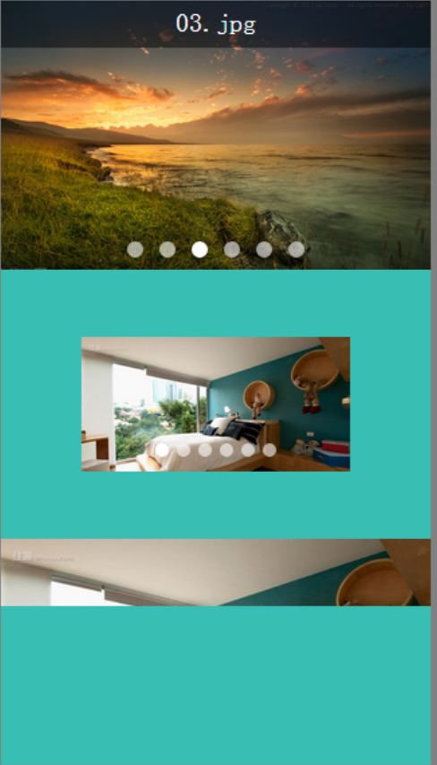

<h1>TouchSlide</h1>
==========

<h3>TouchSlide是一个移动设备上touch事件的滚动插件，在移动设备上可以平滑的滑动</h3>

<h4>使用说明：</h4>

<pre>
	
	
	
	$(document).ready(function(){
		TouchSlider({
			container: 'touchSliderCon', 	//外层ID
			height: 200,					//容器高度，必须指定
			width: 320, 					//容器宽度,默认为窗口宽度
			index: 2,						//默认显示滴几张，默认 0
			duration: 0.3,					//transition-duration的切换时间， 默认 0.3， 自动切换时间 = 0.3 * 10000
			data: data,						//图片数据
			isShowTip: true,				//是否显示标题提示
			autoPlay: true, 				//是否自动切换,默认 true，
			buttonStyle: "", 				//按钮样式, 如果不显示按钮，可以设为 "display:none;"
			callback: function(index){		//touchend后回调
				console.log(index)
			}
		});
	});
</pre>

<h4>data数据</h4>

<pre>
	var data = [
			{
				"src": "images/01.jpg",
				"link": "#",
				"title": "01.jpg"
			},
			{
				"src": "images/02.jpg",
				"link": "#",
				"title": "02.jpg"
			},
			{
				"src": "images/03.jpg",
				"link": "#",
				"title": "03.jpg"
			},
			{
				"src": "images/04.jpg",
				"link": "#",
				"title": "04.jpg"
			},
			{
				"src": "images/05.jpg",
				"link": "#",
				"title": "05.jpg"
			},
			{
				"src": "images/06.jpg",
				"link": "#",
				"title": "06.jpg"
			}
		];
</pre>

	<h5>预览</h5>
	 
	 
	

	readMore me: <a href="www.senuu.com" target="_blank">www.senuu.com ( 盛艺 )</a>

